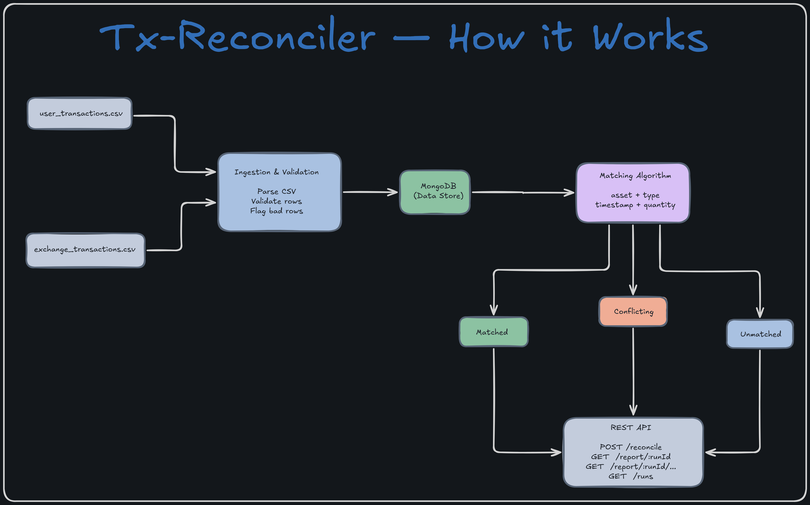

# Tx-Reconciler


> Built as part of the KoinX Backend Intern Assignment.

A transaction reconciliation engine built in Node.js. Ingests crypto transaction records from two sources — a user-exported file and an exchange-exported file — matches them against each other, flags data quality issues, and produces a structured reconciliation report accessible via a REST API.


## How It Works



### Ingestion

Both CSV files are parsed row by row. Each row is validated for required fields, a parseable timestamp, a positive quantity, and a known transaction type. Invalid rows are not dropped — they are stored separately with a specific reason for rejection. Valid rows are normalised (asset aliases resolved, types uppercased) and stored in MongoDB tagged with a `runId`.

### Matching

For each valid user transaction, the engine searches for a candidate in the exchange transactions where:

- Asset matches (after alias normalisation)
- Type is compatible (exact match or known perspective flip)
- Timestamp is within the configured tolerance window
- Quantity difference is within the configured percentage tolerance

If multiple candidates exist, the closest by timestamp is chosen. Unmatched exchange transactions are collected after all user transactions have been processed.

### Report

Results are stored in MongoDB under a unique `runId` returned by the `/reconcile` endpoint. All subsequent report endpoints read from this stored result.

## Getting Started

### With Docker (recommended)

```bash
git clone git@github.com:Alokxk/Tx-Reconciler.git
cd Tx-Reconciler
docker compose up --build
```

The API will be available at `http://localhost:3000`.

### Without Docker

**Prerequisites:** Node.js v18+, a running MongoDB instance.

```bash
git clone git@github.com:Alokxk/Tx-Reconciler.git
cd Tx-Reconciler
npm install
cp .env.example .env
# Edit .env and set MONGODB_URI to your MongoDB connection string
npm run dev
```

## API Reference

### `POST /reconcile`

Triggers a reconciliation run against the files in the `data/` directory.

Accepts an optional JSON body to override default tolerances:

```json
{
  "timestampToleranceSeconds": 60,
  "quantityTolerancePct": 0.005
}
```

Response:

```json
{
  "runId": "uuid",
  "createdAt": "ISO timestamp",
  "ingestion": {
    "user": { "total": 26, "inserted": 22, "flagged": 4 },
    "exchange": { "total": 25, "inserted": 25, "flagged": 0 }
  },
  "summary": {
    "matched": 22,
    "conflicting": 0,
    "unmatchedUser": 0,
    "unmatchedExchange": 3,
    "dataQualityIssues": 4
  }
}
```

### `GET /report/:runId`

Returns the full reconciliation report including all matched, conflicting, and unmatched entries.

### `GET /report/:runId/summary`

Returns only the counts and config for a run.

```json
{
  "runId": "uuid",
  "createdAt": "ISO timestamp",
  "config": {
    "timestampToleranceSeconds": 300,
    "quantityTolerancePct": 0.01
  },
  "summary": {
    "matched": 22,
    "conflicting": 0,
    "unmatchedUser": 0,
    "unmatchedExchange": 3,
    "dataQualityIssues": 4
  }
}
```


### `GET /report/:runId/unmatched`

Returns only the unmatched entries from both sources with reasons.


### `GET /report/:runId/quality-issues`

Returns all rows that failed validation during ingestion, with per-row reasons.

```json
{
  "runId": "uuid",
  "total": 4,
  "issues": [
    {
      "source": "user",
      "rowNumber": 17,
      "transactionId": "USR-001",
      "reasons": ["duplicate transaction_id: USR-001"],
      "rawData": {}
    }
  ]
}
```


### `GET /report/:runId/export`

Downloads the full reconciliation report as a CSV file. Each row contains the category (`MATCHED`, `CONFLICTING`, `UNMATCHED_USER`, `UNMATCHED_EXCHANGE`), both sides of the transaction where available, and the reason for categorisation.


### `GET /runs`

Returns a list of all reconciliation runs with their summaries, sorted by most recent first.


## Configuration

| Variable                      | Default                               | Description                                       |
| ----------------------------- | ------------------------------------- | ------------------------------------------------- |
| `PORT`                        | `3000`                                | Port the server listens on                        |
| `MONGODB_URI`                 | `mongodb://mongo:27017/tx-reconciler` | MongoDB connection string                         |
| `TIMESTAMP_TOLERANCE_SECONDS` | `300`                                 | Max timestamp difference for a match              |
| `QUANTITY_TOLERANCE_PCT`      | `0.01`                                | Max quantity difference as a fraction (0.01 = 1%) |

Tolerances can also be overridden per-request via the `POST /reconcile` body.


## Project Structure

```
src/
  config/         # environment variables and tolerance defaults
  models/         # Mongoose schemas: Transaction, DataQualityIssue, ReconciliationReport
  services/       # ingestion, matching algorithm, reporter
  utils/          # asset normaliser, type mapper
  routes/         # Express route handlers
assets/           # architecture diagram
data/             # input CSV files
server.js         # entry point
docker-compose.yml
Dockerfile
```

---

## Design Decisions

**Why MongoDB over SQL**
The input CSV data has variable quality — missing fields, malformed values, unexpected nulls. MongoDB's flexible schema allows partially valid rows to be stored in the `DataQualityIssue` collection without requiring nullable column definitions or schema migrations. For a data ingestion pipeline where input quality is not guaranteed, this is the right tradeoff.

**Matching algorithm**
The matcher iterates over each valid user transaction and filters exchange transactions by asset, type compatibility, and timestamp window. From the remaining candidates it picks the closest by timestamp delta, then checks quantity tolerance to decide between `matched` and `conflicting`. This is O(n×m) which is acceptable for the dataset sizes this engine is designed for. At scale (100k+ rows), the approach would shift to sorting both sets by timestamp and using a sliding window with indexed range queries.

**runId and immutability**
Each call to `POST /reconcile` generates a UUID and stores all results tagged with it. This makes every reconciliation run independently addressable and immutable. You can compare results across runs, and re-running does not overwrite previous reports.

**TRANSFER_OUT / TRANSFER_IN perspective flip**
The same transfer transaction appears as `TRANSFER_OUT` in the user file and `TRANSFER_IN` in the exchange file — opposite perspectives of the same event. The type mapper explicitly handles this equivalence so these pairs are matched correctly.

**Asset alias normalisation**
User-exported data often uses full names (`bitcoin`, `ethereum`) while exchanges use tickers (`BTC`, `ETH`). All assets are normalised to uppercase tickers before matching using a static alias map. New aliases can be added to `src/utils/assetNormalizer.js` without touching the matching logic.

**Data quality: flag, never drop**
Invalid rows are stored in a separate `DataQualityIssue` collection with the original raw data and a specific reason per field that failed. This preserves the full audit trail and makes the `/quality-issues` endpoint useful for debugging source data problems.

---

## Known Limitations and Production Considerations

- **No pagination** on report endpoints. For large datasets, responses would need to be paginated or streamed.
- **No authentication.** In production, endpoints would be protected and scoped to a user or organisation.
- **O(n×m) matching** does not scale past ~100k rows. The production approach would sort transactions by timestamp and use indexed range queries in MongoDB to find candidates, reducing complexity significantly.
- **No test suite.** Unit tests would cover the matcher (pure function, easy to test), the validator in ingestion, and the asset normaliser. Integration tests would cover the full reconcile flow against known fixture data.
- **Static file paths.** The engine currently reads from `data/`. In production, file paths or upload URLs would be passed as request parameters.
- **No retry or idempotency.** If a reconciliation run fails midway, there is no built-in retry mechanism. Idempotency keys could be added to prevent duplicate runs on the same data.
- **No real-time updates.** The API is designed for batch processing. For a real-time reconciliation engine, a streaming architecture with message queues would be more appropriate.
